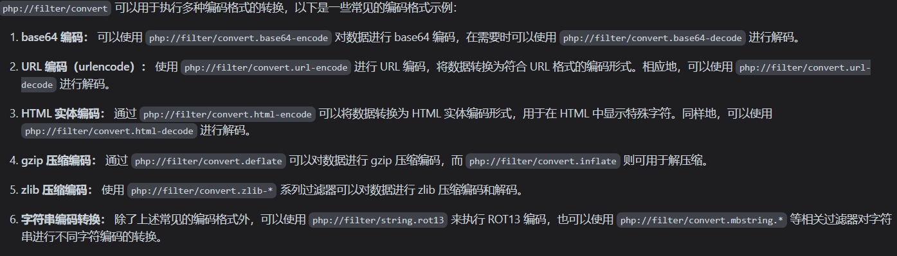

# include+php伪协议

## 1.1 文件包含

!> include('1.txt') 将尝试包含并执行 1.txt 文件中的PHP代码。如果 1.txt 中包含的是PHP代码，则该代码将被执行。如果文件中包含的是普通文本，那么这段文本将被输出到屏幕上，因为 include() 在处理纯文本文件时会直接输出文件内容。

## 1.2 伪协议

> 在文件包含时使用php伪协议，常见的文件包含函数如下1 include **2 require** 3 include_once 4 require_once 5 highlight_file 6 show_source **7 file** **8 readfile** 9 file_get_contents 10 file_put_contents 11 fopen  将一个文件的内容包含到另一个文件  

### 常用php伪协议

> PHP 伪协议是一种特殊的 PHP 特性，允许在 PHP 中通过类似 URL 的方式来访问各种资源，如文件、数据流等
> - file://: 允许 PHP 访问本地文件系统中的文件
> - http:// 或 https://: 允许 PHP 通过 HTTP 或 HTTPS 协议访问远程服务器上的资源
> - ftp://: 允许 PHP 通过 FTP 协议访问远程 FTP 服务器上的文件。
> - php://: 提供了访问各种输入输出流的方式
> - data://: 允许在 PHP 中直接使用数据 URI，将数据嵌入到 URL 中

payload1：**url?c=include$_GET[1];&1=php://filter/convert.base64-encode/resource=flag.php**

#### 拆分

**php://filter**作用将数据，文件内容封装起来

**convert**数据编码转换器，不进行编码的话，flag.php会作为php文件运行，无法看到文件内容  

**base64-encode**使用base64的编码格式打印出来


payload2：**url?c=include$_GET[1];&1=data:text/plain,<?php echo "helloworld"?>**  

### data:text/plain  

!> 注意：data:text/plain，php://input等伪协议需要在配置文件中打开**allow_url_fopen，allow_url_include**这两项  

!> 注意：data:text/plain，php://input等伪协议需要在配置文件中打开**allow_url_fopen，allow_url_include**这两项  

!> 注意：data:text/plain，php://input等伪协议需要在配置文件中打开**allow_url_fopen，allow_url_include**这两项  

> 数据流封装器，以传递相应格式的数据。可以让用户来控制输入流，当它与包含函数结合时，用户输入的data:text/plain流会被当作php文件执行。

两种形式
> data://text/plain在 PHP 中可用于打开文本数据流，而data:text/plain则是在 URL 中表示纯文本数据的 MIME 类型。

用法：

```php
url?c=include$_GET[1];&1=data:text/plain,<?php phpinfo();?>
url?c=include$_GET[1];&1=data:text/plain;base64,PD9waHAgcGhwaW5mbygpOz8%2b
```

### php://input

> 可以访问请求的原始数据的只读流，将post请求的数据当作php代码执行  

payload3：**url?c=include$_GET[1];&1=php://input**

POST:  

```php
echo'hello'
```

## 2.1 include+日志注入

> 对于Nginx  
> 默认的日志文件目录通常如下：
访问日志（Access Log）：  
> 通常位于/var/log/nginx/access.log  
> Apache  
> 对于Apache（有时也称为Apache HTTP Server），默认的日志文件目录通常依赖于你使用的Linux发行版，但一般情况如下：

访问日志（Access Log）：

> - 对于Ubuntu/Debian系统，通常位于/var/log/apache2/access.log
> - 对于CentOS/RHEL系统，通常位于/var/log/httpd/access_log

在f12浏览器调试下，可以看到服务器类型，ctfshow中靶机是nginx

nginx日志文件目录/var/log/nginx/access.log，对于当前网页的相对路径不确定，用../试试，../../../三级时可以访问到日志文件，使用post在报文的UA值中写入一句话木马，或phpinfo函数，试试看能否写入日志文件
