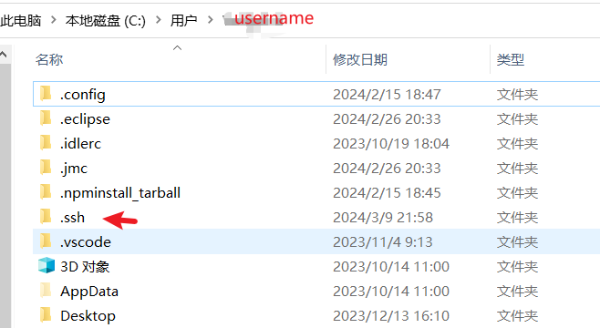
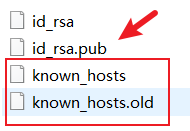

**这是一个基于Github pages + docsify的主题笔记(博客)，在搭建过程遇到了一些git的用法,具体由GPT生成，暂时记下**

!> 注意：当多人/多台设备维护一个项目时，项目内个人环境不同，使用.gitignore文件让git忽略这些内容，避免导致其他设备拉取时，运行错误或不必要的问题

```git
git clone https://github.com/username/repository.git                                                      
                                使用http协议克隆仓库
git clone git clone git@github.com:username/repository.git
                                使用ssh协议克隆仓库
ssh-keygen -t rsa -b 4096 -C "your_email"   生成密钥

git config --global user.name "user_name"    配置用户名

git config --global user.email "user_email"  配置用户邮箱

ssh -T git@github.commit        测试远程仓库连接

git init                        初始化本地git仓库

git add -A                      将修改添加到暂存区，为下一次操作做准备 等同于分开执行 git add . 和 git add -u 的组合

git add .                       添加当前目录下的所有新文件和修改过的文件到暂存区，但不包括删除的文件

git add -u                      更新已跟踪的文件，包括修改过的文件和删除的文件，但不会添加新文件

git status                      检查当前状态，确认哪些更改将被提交

git rm -r --cached dir/         删除暂存区某目录下内容

git commit -m "words"           用于将暂存区（stage）中的更改记录到仓库历史

git remote set-url origin url   在 Git 版本控制系统中用于更改现有远程仓库的 URL

git push -u origin master       在 Git 中用于将你的本地 master 分支的更改推送到远程仓库
```

补充：**于2024/3/16更新补充**  

## 以写一次博客常用操作为例

### 1.初始化本地仓库

新建一个文件夹，用来储存要克隆别人仓库的内容

 ```git
git init                        初始化本地git仓库
```

### 2.在Github克隆某个仓库项目

在上面新建的文件夹克隆

 ```git
git clone https://github.com/username/repository.git
```

### 3.使用git生成一份rsa密钥

这个密钥会在C:盘user的.ssh目录下保留一份

 ```git
ssh-keygen -t rsa -b 4096 -C "your_email"
```

### 4.本地绑定Git身份

 ```git
git config --global user.name "user_name"    配置用户名
git config --global user.email "user_email"  配置用户邮箱
```

### 5。复制本地rsa公钥

在C盘/用户/.ssh目录下复制rsa公钥

你需要复制rsa_pub公钥文件内的全部内容，在Github设置中，添加ssh认证，把公钥内容放进去，之后会生成两个文件




### 6.测试连接

 ```git
ssh -T git@github.commit        测试远程仓库连接
```

如果返回了hi!Your_username,那么就连接成功了，你可以远程操控Github的仓库，上传/拉取

### 7.暂存修改

这不会立即提交到远程仓库，本地会有一个暂存区~(反悔容错)~

```git
git add -A                      将所有修改添加到暂存区
```

### 8.查看状态

```git
git status                      检查当前状态，查看你距离上次上传有哪些改动
```

### 9.记录提交请求

将你的提交words记录到远程仓库~(这一步并没提交?类似让远程仓库记录一下)~

```git
git commit -m "words"           用于将暂存区（stage）中的更改记录到仓库历史，words改为你本次做了哪些改动
```

### 10.推送

将改动新增等内容推送提交到远程仓库

```git
git push -u origin master       在 Git 中用于将你的本地 master 分支的更改推送到远程仓库
```
